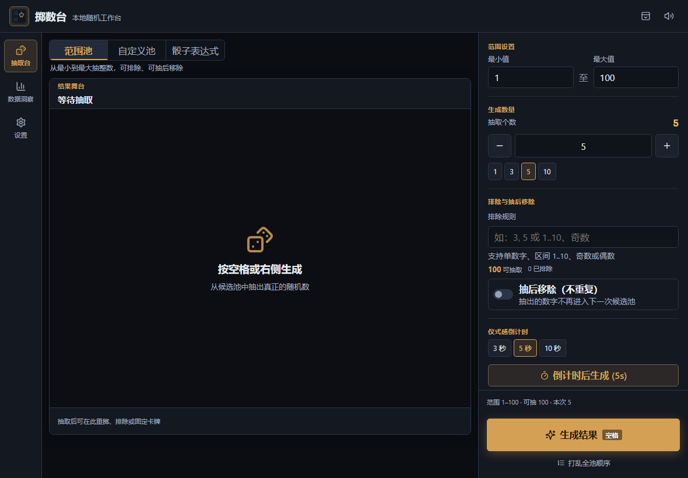

# 掷数台

掷数台是面向 Windows 11 x64 的离线随机抽取工作台，使用 React、TypeScript、Vite、Tauri 2 和 Rust 构建。随机结果在本地生成，不使用远程字体、网络 API、账户、遥测或自动更新。



## 主要功能

- 范围池、自定义数字池和骰子表达式三种抽取模式
- 整数、闭区间、奇数、偶数排除规则与“抽后移除”
- Web Crypto 无偏随机，生成动画不参与结果计算
- 单项选择、局部重掷、固定结果、加入排除和事务撤销
- 三种模式分别记忆抽取数量
- 3/5/10 秒倒计时与 `Space`、`Enter`、`Shift+Space` 快捷键
- 历史记录、频次、覆盖率、趋势和概率分析
- JSON、CSV、PNG、审计回执和完整备份
- 深色、浅色、高对比主题与减少动态效果支持
- 完全离线运行，数据保存在本机

## 下载

请从 GitHub Releases 下载：

- `掷数台.exe`：单文件便携版，目标电脑需要已有 Microsoft Edge WebView2 Runtime。
- `掷数台-v0.5.0-便携完整包.zip`：多文件便携包，包含程序、使用说明、许可证和 SHA256 校验文件。
- `掷数台-离线安装版-setup.exe`：离线安装程序，内置 WebView2 安装能力，文件较大。

当前版本未进行代码签名，Windows SmartScreen 可能显示“未知发布者”。请只从本仓库 Releases 下载，并使用发布页提供的 SHA256 校验值核对文件。

## 本地开发

环境要求：Node.js 24 LTS、npm 11、Rust stable、Microsoft C++ Build Tools 和 WebView2 Runtime。

```powershell
git clone https://github.com/Allserial/zhishutai.git
Set-Location .\zhishutai
npm install
npm run dev
```

浏览器默认访问 `http://localhost:5173/`。

常用质量检查：

```powershell
npm run icons:verify
npm run lint
npm run typecheck
npm run test
npm run test:e2e
npm run build
```

Tauri 开发与构建：

```powershell
npm run tauri:dev
npm run tauri:build:portable
npm run tauri:build:offline
```

## 本地数据

- Tauri 状态文件：`%APPDATA%\com.zhishutai.desktop\state-v5.json`
- 浏览器调试版：IndexedDB `zhishutai-v5`
- 备份格式：`zhishutai.backup.v5`

应用不会上传这些数据。卸载或手动清理应用数据前，请先在设置中导出完整备份。

## 安全与隐私

仓库不应包含真实账号、邮箱、令牌、私钥、本机绝对路径、应用数据或个人测试记录。安全问题请按照 [SECURITY.md](SECURITY.md) 使用 GitHub 的私密安全报告渠道。

## 许可证

本项目采用 [MIT License](LICENSE)。第三方依赖仍分别遵循各自许可证，正式 Release 附带依赖许可证清单。
